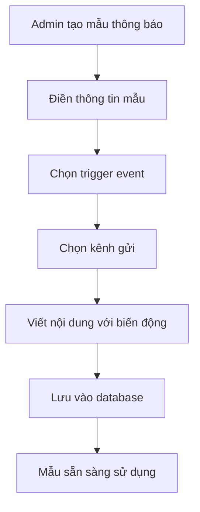
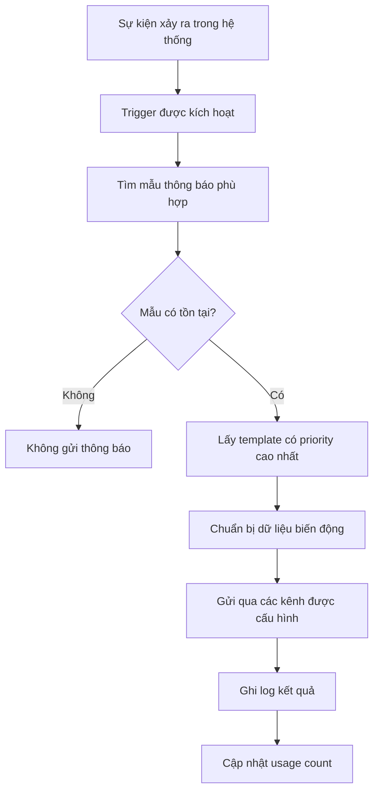

# Tài liệu Hệ thống Quản lý Thông báo

## Tổng quan

Hệ thống quản lý thông báo trong ứng dụng spa được thiết kế để tự động gửi thông báo cho khách hàng thông qua nhiều kênh khác nhau (Email, SMS) dựa trên các sự kiện (triggers) trong hệ thống.

## Kiến trúc hệ thống

### 1. Các thành phần chính

```
┌─────────────────┐    ┌──────────────────┐    ┌─────────────────┐
│   Frontend      │    │     Backend      │    │   External      │
│   (React)       │    │   (Node.js)      │    │   Services      │
├─────────────────┤    ├──────────────────┤    ├─────────────────┤
│ AdminNotifications│   │ notificationService│   │ Email Service   │
│ - Templates     │◄──►│ - sendNotification│◄──►│ SMS Service     │
│ - Logs          │    │ - Templates      │    │                 │
│ - Editor        │    │ - Logs           │    │                 │
└─────────────────┘    └──────────────────┘    └─────────────────┘
```

### 2. Database Models

#### NotificationTemplate

- **Mục đích**: Lưu trữ các mẫu thông báo
- **Các trường chính**:
  - `name`: Tên mẫu thông báo
  - `type`: Loại thông báo (confirmation, reminder, etc.)
  - `trigger`: Sự kiện kích hoạt (appointment_created, appointment_reminder, etc.)
  - `subject`: Tiêu đề thông báo
  - `content`: Nội dung thông báo với biến động
  - `channels`: Kênh gửi (email, sms, push, whatsapp, phone)
  - `variables`: Danh sách biến có thể sử dụng
  - `timing`: Cấu hình thời gian gửi
  - `conditions`: Điều kiện áp dụng
  - `isActive`: Trạng thái hoạt động
  - `priority`: Độ ưu tiên

#### NotificationLog

- **Mục đích**: Ghi log tất cả thông báo đã gửi
- **Các trường chính**:
  - `templateId`: ID mẫu thông báo
  - `customerId`: ID khách hàng
  - `appointmentId`: ID lịch hẹn (nếu có)
  - `channel`: Kênh gửi
  - `recipient`: Thông tin người nhận
  - `content`: Nội dung đã gửi
  - `status`: Trạng thái (pending, sent, delivered, failed, etc.)
  - `sentAt`: Thời gian gửi
  - `error`: Thông tin lỗi (nếu có)

## Luồng hoạt động

### 1. Luồng tạo và quản lý mẫu thông báo



### 2. Luồng gửi thông báo tự động



### 3. Các Trigger Events

| Trigger                   | Mô tả                | Khi nào kích hoạt                 |
| ------------------------- | -------------------- | --------------------------------- |
| `appointment_created`     | Tạo lịch hẹn mới     | Khi admin tạo lịch hẹn thành công |
| `appointment_reminder`    | Nhắc lịch hẹn        | Trước giờ hẹn (có thể cấu hình)   |
| `appointment_rescheduled` | Thay đổi lịch hẹn    | Khi admin cập nhật lịch hẹn       |
| `appointment_cancelled`   | Hủy lịch hẹn         | Khi admin hủy lịch hẹn            |
| `appointment_completed`   | Hoàn thành dịch vụ   | Khi đánh dấu lịch hẹn hoàn thành  |
| `customer_birthday`       | Sinh nhật khách hàng | Vào ngày sinh nhật                |
| `customer_anniversary`    | Kỷ niệm              | Vào ngày kỷ niệm                  |
| `promotion_created`       | Khuyến mãi mới       | Khi tạo khuyến mãi                |
| `feedback_request`        | Yêu cầu đánh giá     | Sau khi hoàn thành dịch vụ        |
| `manual`                  | Gửi thủ công         | Khi admin gửi thủ công            |

## Cách thức hoạt động

### 1. Biến động (Variables)

Hệ thống hỗ trợ các biến động sau trong nội dung thông báo:

```javascript
const variables = {
  customer_name: "Tên khách hàng",
  customer_phone: "Số điện thoại",
  customer_email: "Email khách hàng",
  service_name: "Tên dịch vụ",
  appointment_date: "Ngày hẹn",
  start_time: "Giờ bắt đầu",
  end_time: "Giờ kết thúc",
  staff_name: "Tên nhân viên",
  branch_name: "Tên chi nhánh",
  amount: "Số tiền",
  appointment_number: "Mã lịch hẹn",
};
```

**Cách sử dụng trong template:**

```
Xin chào {{customer_name}}!

Lịch hẹn của bạn đã được tạo thành công:
- Dịch vụ: {{service_name}}
- Ngày: {{appointment_date}}
- Giờ: {{start_time}} - {{end_time}}
- Nhân viên: {{staff_name}}
- Mã lịch hẹn: {{appointment_number}}

Cảm ơn bạn!
```

### 2. Kênh gửi thông báo

#### Email

- **Service**: `emailService.js`
- **Provider**: Có thể sử dụng SendGrid, Nodemailer, etc.
- **Features**: HTML content, attachments, tracking

#### SMS

- **Service**: `smsService.js`
- **Provider**: Có thể sử dụng Twilio, Viettel, etc.
- **Features**: Unicode support, delivery status

### 3. Cấu hình thời gian gửi

#### Immediate (Ngay lập tức)

- Gửi ngay khi trigger được kích hoạt

#### Scheduled (Theo lịch)

- Gửi vào giờ cố định hàng ngày
- Ví dụ: 9:00 AM mỗi ngày

#### Relative (Tương đối)

- Gửi sau một khoảng thời gian từ trigger
- Ví dụ: 1 giờ trước lịch hẹn, 1 ngày sau khi tạo lịch

## API Endpoints

### Templates Management

- `GET /api/admin/notifications/templates` - Lấy danh sách mẫu
- `POST /api/admin/notifications/templates` - Tạo mẫu mới
- `PUT /api/admin/notifications/templates/:id` - Cập nhật mẫu
- `DELETE /api/admin/notifications/templates/:id` - Xóa mẫu
- `PATCH /api/admin/notifications/templates/:id/toggle` - Bật/tắt mẫu

### Logs Management

- `GET /api/admin/notifications/logs` - Lấy danh sách log
- `GET /api/admin/notifications/sms/logs` - Lấy log SMS

### Testing & Sending

- `POST /api/admin/notifications/send` - Gửi thông báo test
- `POST /api/admin/notifications/sms/bulk` - Gửi SMS hàng loạt

## Cách implement tự động hóa

### 1. Thêm trigger vào Appointment Controller

```javascript
// Trong createAppointment function
import { sendNotification } from "../services/notificationService.js";

// Sau khi tạo appointment thành công
await newAppointment.save();

// Gửi thông báo xác nhận
try {
  await sendNotification(
    "appointment_created",
    {
      id: customerDoc._id,
      name: customerDoc.name,
      phone: customerDoc.phone,
      email: customerDoc.email,
    },
    {
      serviceName: serviceDoc.name,
      appointmentDate: formatDateToVietnamString(
        newAppointment.appointmentDate
      ),
      startTime: newAppointment.startTime,
      endTime: newAppointment.endTime,
      staffName: populatedAppointment.staffId?.name,
      totalAmount: newAppointment.totalAmount,
      appointmentNumber: newAppointment.appointmentNumber,
    }
  );
} catch (error) {
  console.error("Error sending notification:", error);
  // Không throw error để không ảnh hưởng đến việc tạo appointment
}
```

### 2. Thêm trigger cho các sự kiện khác

```javascript
// Trong updateAppointment function
if (existingAppointment.status !== status) {
  let trigger = "";
  switch (status) {
    case "cancelled":
      trigger = "appointment_cancelled";
      break;
    case "completed":
      trigger = "appointment_completed";
      break;
    case "rescheduled":
      trigger = "appointment_rescheduled";
      break;
  }

  if (trigger) {
    await sendNotification(trigger, customerData, appointmentData);
  }
}
```

### 3. Tạo cron job cho reminder

```javascript
// Tạo file: services/reminderService.js
import cron from "node-cron";
import { sendNotification } from "./notificationService.js";

// Chạy mỗi 30 phút để kiểm tra lịch hẹn cần nhắc
cron.schedule("*/30 * * * *", async () => {
  const now = new Date();
  const oneHourLater = new Date(now.getTime() + 60 * 60 * 1000);

  // Tìm lịch hẹn trong 1 giờ tới
  const upcomingAppointments = await Appointment.find({
    appointmentDate: {
      $gte: now,
      $lte: oneHourLater,
    },
    status: "confirmed",
  }).populate("customerId serviceId staffId");

  for (const appointment of upcomingAppointments) {
    await sendNotification(
      "appointment_reminder",
      {
        id: appointment.customerId._id,
        name: appointment.customerId.name,
        phone: appointment.customerId.phone,
        email: appointment.customerId.email,
      },
      {
        serviceName: appointment.serviceId.name,
        appointmentDate: formatDateToVietnamString(appointment.appointmentDate),
        startTime: appointment.startTime,
        endTime: appointment.endTime,
        staffName: appointment.staffId.name,
        appointmentNumber: appointment.appointmentNumber,
      }
    );
  }
});
```

## Cấu hình và triển khai

### 1. Environment Variables

```env
# Email Configuration
EMAIL_SERVICE=sendgrid
SENDGRID_API_KEY=your_sendgrid_key
EMAIL_FROM=noreply@yourspa.com

# SMS Configuration
SMS_SERVICE=twilio
TWILIO_ACCOUNT_SID=your_account_sid
TWILIO_AUTH_TOKEN=your_auth_token
TWILIO_PHONE_NUMBER=your_phone_number

# Notification Settings
NOTIFICATION_ENABLED=true
REMINDER_HOURS_BEFORE=1
```

### 2. Khởi tạo dữ liệu mẫu

```javascript
// Tạo các template mẫu khi khởi động ứng dụng
const defaultTemplates = [
  {
    name: "Xác nhận lịch hẹn",
    type: "confirmation",
    trigger: "appointment_created",
    subject: "Xác nhận lịch hẹn - {{appointment_number}}",
    content: "Xin chào {{customer_name}}! Lịch hẹn của bạn đã được xác nhận...",
    channels: ["email", "sms"],
    isActive: true,
    priority: 1,
  },
  {
    name: "Nhắc lịch hẹn",
    type: "reminder",
    trigger: "appointment_reminder",
    subject: "Nhắc lịch hẹn - {{appointment_number}}",
    content:
      "Xin chào {{customer_name}}! Bạn có lịch hẹn vào {{appointment_date}} lúc {{start_time}}...",
    channels: ["sms"],
    isActive: true,
    priority: 1,
  },
];
```

## Monitoring và Debugging

### 1. Logs và Analytics

- **NotificationLog**: Ghi lại tất cả thông báo đã gửi
- **Status tracking**: Theo dõi trạng thái gửi (sent, delivered, failed)
- **Error handling**: Ghi lại lỗi và retry logic

### 2. Dashboard Metrics

- Tổng số thông báo đã gửi
- Tỷ lệ thành công/thất bại
- Thống kê theo kênh (email vs SMS)
- Thống kê theo loại thông báo

### 3. Testing

- **Test notification**: Gửi thử với dữ liệu mẫu
- **Bulk testing**: Test với nhiều người nhận
- **Channel testing**: Test từng kênh riêng biệt

## Lưu ý quan trọng

1. **Error Handling**: Luôn có try-catch để tránh ảnh hưởng đến chức năng chính
2. **Rate Limiting**: Giới hạn số lượng thông báo gửi để tránh spam
3. **Data Privacy**: Tuân thủ quy định về bảo mật thông tin khách hàng
4. **Cost Management**: Theo dõi chi phí gửi SMS/Email
5. **Fallback**: Có kế hoạch dự phòng khi service bên ngoài lỗi

## Kết luận

Hệ thống thông báo được thiết kế để:

- **Tự động hóa**: Gửi thông báo dựa trên sự kiện
- **Linh hoạt**: Dễ dàng tạo và quản lý mẫu thông báo
- **Đa kênh**: Hỗ trợ nhiều kênh gửi
- **Theo dõi**: Ghi log và theo dõi hiệu quả
- **Mở rộng**: Dễ dàng thêm trigger và kênh mới

Để hệ thống hoạt động tự động, cần implement các trigger trong các controller tương ứng và thiết lập cron job cho các thông báo theo lịch.
