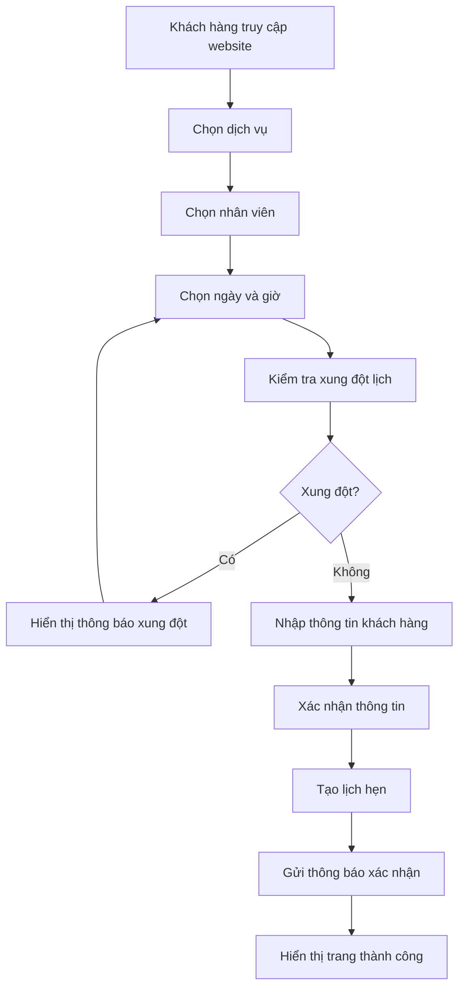
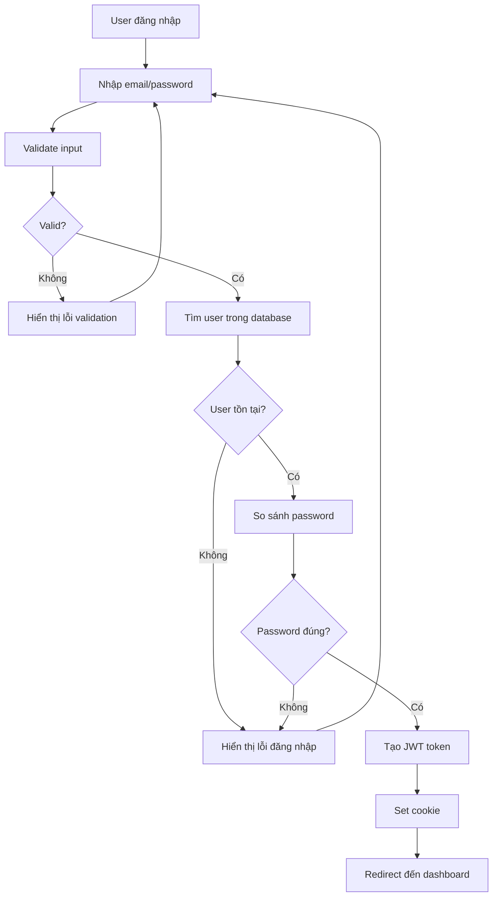
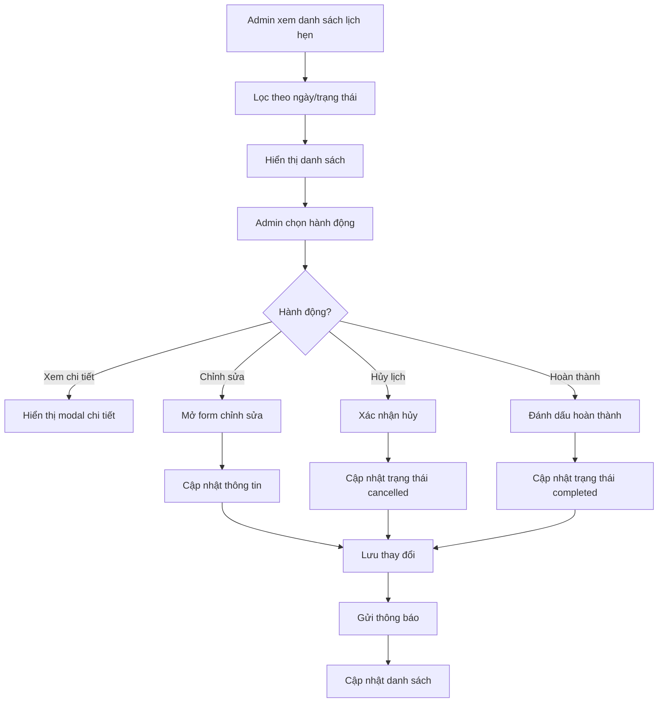

# CHƯƠNG 3: THIẾT KẾ HỆ THỐNG

## 3.1. Kiến trúc tổng thể hệ thống

### 3.1.1. Kiến trúc Client-Server

Hệ thống được thiết kế theo mô hình Client-Server với kiến trúc 3-tier:

```
┌─────────────────┐    HTTP/HTTPS    ┌─────────────────┐
│   Client Tier   │ ◄──────────────► │  Application    │
│   (React SPA)   │                  │     Tier        │
│                 │                  │  (Node.js API)  │
└─────────────────┘                  └─────────────────┘
                                              │
                                              │
                                              ▼
                                     ┌─────────────────┐
                                     │   Database      │
                                     │     Tier        │
                                     │   (MongoDB)     │
                                     └─────────────────┘
```

#### 3.1.1.1. Client Tier (Frontend)

- **Technology**: React.js với Vite build tool
- **UI Framework**: Ant Design + Tailwind CSS
- **State Management**: React Hooks (useState, useEffect, useContext)
- **Routing**: React Router DOM
- **HTTP Client**: Axios với interceptors

#### 3.1.1.2. Application Tier (Backend)

- **Technology**: Node.js với Express.js framework
- **Architecture**: MVC pattern với RESTful API
- **Authentication**: JWT với cookie-based storage
- **Validation**: express-validator
- **CORS**: Cross-origin resource sharing

#### 3.1.1.3. Database Tier

- **Technology**: MongoDB với Mongoose ODM
- **Connection**: Mongoose connection pooling
- **Indexing**: Compound và text indexes
- **Validation**: Schema-level validation

### 3.1.2. Kiến trúc module

```
┌─────────────────────────────────────────────────────────┐
│                    CLIENT (React SPA)                   │
├─────────────────────────────────────────────────────────┤
│  ┌─────────────┐  ┌─────────────┐  ┌─────────────┐     │
│  │   Public    │  │    User     │  │    Admin    │     │
│  │   Pages     │  │   Pages     │  │   Pages     │     │
│  └─────────────┘  └─────────────┘  └─────────────┘     │
└─────────────────────────────────────────────────────────┘
                              │
                              │ HTTP Requests
                              ▼
┌─────────────────────────────────────────────────────────┐
│                  SERVER (Node.js API)                   │
├─────────────────────────────────────────────────────────┤
│  ┌─────────────┐  ┌─────────────┐  ┌─────────────┐     │
│  │   Public    │  │    User     │  │    Admin    │     │
│  │   Routes    │  │   Routes    │  │   Routes    │     │
│  └─────────────┘  └─────────────┘  └─────────────┘     │
│                              │                         │
│  ┌─────────────┐  ┌─────────────┐  ┌─────────────┐     │
│  │ Controllers │  │ Middleware  │  │  Services   │     │
│  └─────────────┘  └─────────────┘  └─────────────┘     │
└─────────────────────────────────────────────────────────┘
                              │
                              │ Database Queries
                              ▼
┌─────────────────────────────────────────────────────────┐
│                   DATABASE (MongoDB)                    │
├─────────────────────────────────────────────────────────┤
│  ┌─────────────┐  ┌─────────────┐  ┌─────────────┐     │
│  │    Users    │  │Appointments │  │  Services   │     │
│  │   Staff     │  │ Categories  │  │             │     │
│  └─────────────┘  └─────────────┘  └─────────────┘     │
└─────────────────────────────────────────────────────────┘
```

### 3.1.3. Luồng xử lý request

```javascript
// server.js - Main server configuration
import express from "express";
import cors from "cors";
import dotenv from "dotenv";
import cookieParser from "cookie-parser";

// Load environment variables
dotenv.config();

// Connect to MongoDB
connectDB();

const app = express();
const port = config.PORT;

// Middleware pipeline
app.use(
  cors({
    origin: config.CORS.ALLOWED_ORIGINS,
    credentials: true,
  })
);
app.use(express.json({ limit: "10mb" }));
app.use(express.urlencoded({ extended: true, limit: "10mb" }));
app.use(cookieParser());

// Request logging middleware
app.use((req, res, next) => {
  console.log(`${new Date().toISOString()} - ${req.method} ${req.path}`);
  next();
});

// API Routes
app.use("/api/auth", authRoutes);
app.use("/api/admin", adminRoutes);
app.use("/api/user/bookings", userBookingsRoutes);
app.use("/api/user/profile", userProfileRoutes);
app.use("/api/public/contact", publicContactRoutes);
app.use("/api/public/services", publicServicesRoutes);
app.use("/api/public/categories", publicCategoriesRoutes);
app.use("/api/public/staff", publicStaffRoutes);
```

## 3.2. Thiết kế cơ sở dữ liệu

### 3.2.1. Tổng quan database schema

Hệ thống sử dụng MongoDB với 5 collections chính:

1. **Users**: Quản lý thông tin người dùng (khách hàng và admin)
2. **Services**: Quản lý dịch vụ và gói combo
3. **Staff**: Quản lý thông tin nhân viên
4. **Appointments**: Quản lý lịch hẹn
5. **Categories**: Quản lý danh mục dịch vụ

### 3.2.2. Chi tiết các models

#### 3.2.2.1. User Model

```javascript
// models/User.js
const userSchema = new mongoose.Schema(
  {
    // Basic Information
    name: {
      type: String,
      required: [true, "Họ tên là bắt buộc"],
      trim: true,
      minlength: [2, "Họ tên phải có ít nhất 2 ký tự"],
      maxlength: [50, "Họ tên không được quá 50 ký tự"],
    },
    email: {
      type: String,
      required: [true, "Email là bắt buộc"],
      unique: true,
      lowercase: true,
      trim: true,
      validate: {
        validator: validator.isEmail,
        message: "Email không hợp lệ",
      },
    },
    phone: {
      type: String,
      required: false,
      unique: false,
      sparse: true,
      validate: {
        validator: function (v) {
          return !v || /^[0-9]{9,11}$/.test(v);
        },
        message: "Số điện thoại phải có 9-11 chữ số",
      },
    },
    password: {
      type: String,
      required: [true, "Mật khẩu là bắt buộc"],
      minlength: [6, "Mật khẩu phải có ít nhất 6 ký tự"],
      select: false,
    },

    // Authentication & Authorization
    role: {
      type: String,
      enum: ["user", "admin"],
      default: "user",
    },
    isEmailVerified: {
      type: Boolean,
      default: false,
    },
    resetPasswordToken: String,
    resetPasswordExpires: Date,
    emailVerificationToken: String,
    emailVerificationExpires: Date,

    // Customer Information
    dateOfBirth: Date,
    gender: {
      type: String,
      enum: ["male", "female", "other"],
    },
    totalSpent: {
      type: Number,
      default: 0,
      min: [0, "Tổng chi tiêu không được âm"],
    },
    totalAppointments: {
      type: Number,
      default: 0,
      min: [0, "Tổng số lịch hẹn không được âm"],
    },
    level: {
      type: String,
      enum: ["Thường", "Loyal", "Premium", "VIP"],
      default: "Thường",
    },
    points: {
      type: Number,
      default: 0,
      min: [0, "Điểm tích lũy không được âm"],
    },

    // Preferences
    preferences: {
      services: [
        {
          type: mongoose.Schema.Types.ObjectId,
          ref: "Service",
        },
      ],
      staff: [
        {
          type: mongoose.Schema.Types.ObjectId,
          ref: "Staff",
        },
      ],
      timeSlots: [String],
      communication: {
        sms: { type: Boolean, default: true },
        email: { type: Boolean, default: true },
        phone: { type: Boolean, default: false },
      },
    },

    // Address & Contact
    address: {
      street: String,
      city: String,
      state: String,
      zipCode: String,
    },
    emergencyContact: {
      name: String,
      phone: String,
      relationship: String,
    },

    // System Fields
    isActive: {
      type: Boolean,
      default: true,
    },
    lastLogin: {
      type: Date,
      default: Date.now,
    },
    lastBooking: Date,
    lastVisit: Date,
    source: {
      type: String,
      enum: [
        "website",
        "referral",
        "walk-in",
        "social",
        "advertisement",
        "other",
      ],
      default: "website",
    },
  },
  {
    timestamps: true,
  }
);
```

#### 3.2.2.2. Service Model

```javascript
// models/Service.js
const addOnSchema = new mongoose.Schema({
  name: {
    type: String,
    required: [true, "Vui lòng nhập tên add-on"],
    trim: true,
  },
  price: {
    type: Number,
    required: [true, "Vui lòng nhập giá add-on"],
    min: [0, "Giá add-on không được âm"],
  },
});

const comboSchema = new mongoose.Schema({
  name: {
    type: String,
    required: [true, "Vui lòng nhập tên combo"],
    trim: true,
  },
  price: {
    type: Number,
    required: [true, "Vui lòng nhập giá combo"],
    min: [0, "Giá combo không được âm"],
  },
  originalPrice: {
    type: Number,
    required: [true, "Vui lòng nhập giá gốc combo"],
    min: [0, "Giá gốc combo không được âm"],
  },
});

const serviceSchema = new mongoose.Schema(
  {
    name: {
      type: String,
      required: [true, "Vui lòng nhập tên dịch vụ"],
      trim: true,
      maxLength: [100, "Tên dịch vụ không được vượt quá 100 ký tự"],
    },
    category: {
      type: mongoose.Schema.Types.ObjectId,
      ref: "Category",
      required: [true, "Vui lòng chọn danh mục"],
    },
    duration: {
      type: Number,
      required: [true, "Vui lòng nhập thời gian dịch vụ"],
      min: [15, "Thời gian dịch vụ tối thiểu 15 phút"],
      max: [480, "Thời gian dịch vụ tối đa 8 giờ"],
    },
    price: {
      type: Number,
      required: [true, "Vui lòng nhập giá dịch vụ"],
      min: [0, "Giá dịch vụ không được âm"],
    },
    description: {
      type: String,
      trim: true,
      maxLength: [1000, "Mô tả không được vượt quá 1000 ký tự"],
    },
    addOns: [addOnSchema],
    combo: [comboSchema],
    displayOrder: {
      type: Number,
      default: 0,
    },
    isActive: {
      type: Boolean,
      default: true,
    },
    isFeatured: {
      type: Boolean,
      default: false,
    },
    images: [
      {
        type: String,
        match: [/^https?:\/\/.+/, "URL hình ảnh không hợp lệ"],
      },
    ],
    tags: [String],
    requirements: {
      type: String,
      trim: true,
      maxLength: [500, "Yêu cầu không được vượt quá 500 ký tự"],
    },
    notes: {
      type: String,
      trim: true,
      maxLength: [500, "Ghi chú không được vượt quá 500 ký tự"],
    },
  },
  {
    timestamps: true,
  }
);
```

#### 3.2.2.3. Staff Model

```javascript
// models/Staff.js
const workScheduleSchema = new mongoose.Schema({
  start: {
    type: String,
    required: true,
    match: [/^([0-1]?[0-9]|2[0-3]):[0-5][0-9]$/, "Giờ bắt đầu không hợp lệ"],
  },
  end: {
    type: String,
    required: true,
    match: [/^([0-1]?[0-9]|2[0-3]):[0-5][0-9]$/, "Giờ kết thúc không hợp lệ"],
  },
  isWorking: {
    type: Boolean,
    default: true,
  },
});

const staffSchema = new mongoose.Schema(
  {
    userId: {
      type: mongoose.Schema.Types.ObjectId,
      ref: "User",
      required: false,
    },
    employeeId: {
      type: String,
      unique: true,
      required: false,
      uppercase: true,
    },
    name: {
      type: String,
      required: [true, "Vui lòng nhập tên nhân viên"],
      trim: true,
      maxLength: [50, "Tên nhân viên không được vượt quá 50 ký tự"],
    },
    phone: {
      type: String,
      match: [/^[0-9]{10,11}$/, "Số điện thoại không hợp lệ"],
      trim: true,
    },
    email: {
      type: String,
      match: [/^[^\s@]+@[^\s@]+\.[^\s@]+$/, "Email không hợp lệ"],
      trim: true,
      lowercase: true,
    },
    role: {
      type: String,
      required: false,
      default: "Nhân viên",
      enum: [
        "Massage Therapist",
        "Beauty Specialist",
        "Hair Stylist",
        "Nail Technician",
        "Spa Therapist",
        "Receptionist",
        "Manager",
        "Nhân viên",
        "Khác",
      ],
    },
    skills: [String],
    workSchedule: {
      monday: workScheduleSchema,
      tuesday: workScheduleSchema,
      wednesday: workScheduleSchema,
      thursday: workScheduleSchema,
      friday: workScheduleSchema,
      saturday: workScheduleSchema,
      sunday: workScheduleSchema,
    },
    daysOff: [Date],
    revenueShare: {
      type: Number,
      min: [0, "Tỷ lệ chia doanh thu không được âm"],
      max: [1, "Tỷ lệ chia doanh thu không được vượt quá 100%"],
      default: 0.3,
    },
    hourlyRate: {
      type: Number,
      min: [0, "Lương theo giờ không được âm"],
      default: 0,
    },
    commission: {
      type: Number,
      min: [0, "Hoa hồng không được âm"],
      default: 0,
    },
    isActive: {
      type: Boolean,
      default: true,
    },
    hireDate: {
      type: Date,
      default: Date.now,
    },
    terminationDate: Date,
    emergencyContact: {
      name: String,
      phone: String,
      relationship: String,
    },
    address: {
      street: String,
      city: String,
      state: String,
      zipCode: String,
    },
    notes: {
      type: String,
      trim: true,
      maxLength: [500, "Ghi chú không được vượt quá 500 ký tự"],
    },
  },
  {
    timestamps: true,
  }
);
```

#### 3.2.2.4. Appointment Model

```javascript
// models/Appointment.js
const appointmentSchema = new mongoose.Schema(
  {
    appointmentNumber: {
      type: String,
      unique: true,
      required: [true, "Vui lòng tạo mã lịch hẹn"],
    },
    customerId: {
      type: mongoose.Schema.Types.ObjectId,
      ref: "User",
      required: [true, "Vui lòng chọn khách hàng"],
    },
    serviceId: {
      type: mongoose.Schema.Types.ObjectId,
      ref: "Service",
      required: [true, "Vui lòng chọn dịch vụ"],
    },
    staffId: {
      type: mongoose.Schema.Types.ObjectId,
      ref: "Staff",
      required: [true, "Vui lòng chọn nhân viên"],
    },
    appointmentDate: {
      type: Date,
      required: [true, "Vui lòng chọn ngày hẹn"],
    },
    startTime: {
      type: String,
      required: [true, "Vui lòng chọn giờ bắt đầu"],
      match: [/^([0-1]?[0-9]|2[0-3]):[0-5][0-9]$/, "Giờ bắt đầu không hợp lệ"],
    },
    endTime: {
      type: String,
      required: [true, "Vui lòng chọn giờ kết thúc"],
      match: [/^([0-1]?[0-9]|2[0-3]):[0-5][0-9]$/, "Giờ kết thúc không hợp lệ"],
    },
    duration: {
      type: Number,
      required: [true, "Vui lòng nhập thời gian dịch vụ"],
      min: [15, "Thời gian dịch vụ tối thiểu 15 phút"],
    },
    status: {
      type: String,
      enum: [
        "pending",
        "confirmed",
        "in-progress",
        "completed",
        "cancelled",
        "no-show",
      ],
      default: "pending",
    },
    totalAmount: {
      type: Number,
      required: [true, "Vui lòng nhập tổng tiền"],
      min: [0, "Tổng tiền không được âm"],
    },
    discount: {
      type: Number,
      default: 0,
      min: [0, "Giảm giá không được âm"],
    },
    finalAmount: {
      type: Number,
      required: [true, "Vui lòng nhập số tiền cuối cùng"],
      min: [0, "Số tiền cuối cùng không được âm"],
    },
    paymentStatus: {
      type: String,
      enum: ["pending", "paid", "partial", "refunded"],
      default: "pending",
    },
    paymentMethod: {
      type: String,
      enum: ["cash", "card", "bank_transfer", "points", "combo"],
    },
    notes: {
      type: String,
      trim: true,
      maxLength: [500, "Ghi chú không được vượt quá 500 ký tự"],
    },
    specialRequests: {
      type: String,
      trim: true,
      maxLength: [500, "Yêu cầu đặc biệt không được vượt quá 500 ký tự"],
    },
    addOns: [
      {
        serviceId: {
          type: mongoose.Schema.Types.ObjectId,
          ref: "Service",
        },
        name: String,
        price: Number,
        quantity: {
          type: Number,
          default: 1,
        },
      },
    ],
    combo: [
      {
        serviceId: {
          type: mongoose.Schema.Types.ObjectId,
          ref: "Service",
        },
        name: String,
        price: Number,
        originalPrice: Number,
      },
    ],
    reminders: [
      {
        type: {
          type: String,
          enum: ["sms", "email", "phone"],
        },
        sentAt: Date,
        status: {
          type: String,
          enum: ["pending", "sent", "failed"],
        },
      },
    ],
    cancellationReason: String,
    cancelledBy: {
      type: String,
      enum: ["customer", "staff", "admin", "system"],
    },
    cancelledAt: Date,
    completedAt: Date,
    rating: {
      score: {
        type: Number,
        min: [1, "Điểm đánh giá tối thiểu là 1"],
        max: [5, "Điểm đánh giá tối đa là 5"],
      },
      comment: {
        type: String,
        trim: true,
        maxLength: [500, "Bình luận không được vượt quá 500 ký tự"],
      },
      ratedAt: Date,
    },
    followUp: {
      required: {
        type: Boolean,
        default: false,
      },
      scheduledDate: Date,
      completed: {
        type: Boolean,
        default: false,
      },
      notes: String,
    },
  },
  {
    timestamps: true,
  }
);
```

#### 3.2.2.5. Category Model

```javascript
// models/Category.js
const categorySchema = new mongoose.Schema(
  {
    name: {
      type: String,
      required: [true, "Tên danh mục là bắt buộc"],
      trim: true,
      maxlength: [100, "Tên danh mục không được vượt quá 100 ký tự"],
    },
    description: {
      type: String,
      trim: true,
      maxlength: [500, "Mô tả không được vượt quá 500 ký tự"],
    },
    slug: {
      type: String,
      unique: true,
      lowercase: true,
      trim: true,
    },
    icon: {
      type: String,
      trim: true,
      validate: {
        validator: function (v) {
          return !v || /^https?:\/\/.+/.test(v);
        },
        message: "Icon phải là URL hợp lệ",
      },
    },
    color: {
      type: String,
      trim: true,
      match: [/^#[0-9A-Fa-f]{6}$/, "Màu sắc phải là mã hex hợp lệ"],
      default: "#3B82F6",
    },
    displayOrder: {
      type: Number,
      default: 0,
      min: [0, "Thứ tự hiển thị không được âm"],
    },
    isActive: {
      type: Boolean,
      default: true,
    },
    parentCategory: {
      type: mongoose.Schema.Types.ObjectId,
      ref: "Category",
      default: null,
    },
    level: {
      type: Number,
      default: 0,
      min: [0, "Cấp độ không được âm"],
    },
    path: {
      type: String,
      default: "",
    },
    serviceCount: {
      type: Number,
      default: 0,
      min: [0, "Số lượng dịch vụ không được âm"],
    },
    seoTitle: {
      type: String,
      trim: true,
      maxlength: [60, "SEO title không được vượt quá 60 ký tự"],
    },
    seoDescription: {
      type: String,
      trim: true,
      maxlength: [160, "SEO description không được vượt quá 160 ký tự"],
    },
    createdBy: {
      type: mongoose.Schema.Types.ObjectId,
      ref: "User",
      required: true,
    },
    updatedBy: {
      type: mongoose.Schema.Types.ObjectId,
      ref: "User",
    },
  },
  {
    timestamps: true,
    toJSON: { virtuals: true },
    toObject: { virtuals: true },
  }
);
```

### 3.2.3. Database Indexing Strategy

#### 3.2.3.1. User Collection Indexes

```javascript
// Indexes for User model
userSchema.index({ email: 1 });
userSchema.index({ phone: 1 }, { sparse: true });
userSchema.index({ role: 1 });
userSchema.index({ isActive: 1 });
userSchema.index({ level: 1 });
userSchema.index({ name: "text" });
userSchema.index({ totalSpent: -1 });
userSchema.index({ lastBooking: -1 });
```

#### 3.2.3.2. Appointment Collection Indexes

```javascript
// Indexes for Appointment model
appointmentSchema.index({ appointmentNumber: 1 });
appointmentSchema.index({ customerId: 1 });
appointmentSchema.index({ serviceId: 1 });
appointmentSchema.index({ staffId: 1 });
appointmentSchema.index({ appointmentDate: 1 });
appointmentSchema.index({ status: 1 });
appointmentSchema.index({ paymentStatus: 1 });
appointmentSchema.index({ createdAt: -1 });

// Compound indexes
appointmentSchema.index({ staffId: 1, appointmentDate: 1, startTime: 1 });
appointmentSchema.index({ customerId: 1, appointmentDate: -1 });
appointmentSchema.index({ status: 1, appointmentDate: 1 });
```

#### 3.2.3.3. Service Collection Indexes

```javascript
// Indexes for Service model
serviceSchema.index({ name: "text", description: "text" });
serviceSchema.index({ category: 1 });
serviceSchema.index({ isActive: 1 });
serviceSchema.index({ isFeatured: 1 });
serviceSchema.index({ displayOrder: 1 });
```

### 3.2.4. Database Relationships

#### 3.2.4.1. One-to-Many Relationships

- **User → Appointments**: Một khách hàng có thể có nhiều lịch hẹn
- **Service → Appointments**: Một dịch vụ có thể được đặt nhiều lần
- **Staff → Appointments**: Một nhân viên có thể có nhiều lịch hẹn
- **Category → Services**: Một danh mục có thể chứa nhiều dịch vụ

#### 3.2.4.2. Many-to-Many Relationships

- **User ↔ Services**: Khách hàng có thể yêu thích nhiều dịch vụ
- **User ↔ Staff**: Khách hàng có thể yêu thích nhiều nhân viên
- **Service ↔ AddOns**: Dịch vụ có thể có nhiều add-ons

#### 3.2.4.3. Self-Referencing Relationships

- **Category → Subcategories**: Danh mục có thể có danh mục con

## 3.3. Thiết kế API endpoints

### 3.3.1. API Architecture Overview

Hệ thống API được tổ chức theo 3 nhóm chính:

```
/api/auth          - Authentication endpoints
/api/admin         - Admin management endpoints
/api/user          - User-specific endpoints
/api/public        - Public access endpoints
```

### 3.3.2. Authentication API

```javascript
// routes/authRoutes.js
POST   /api/auth/register        - Đăng ký tài khoản
POST   /api/auth/login           - Đăng nhập
POST   /api/auth/logout          - Đăng xuất
POST   /api/auth/forgot-password - Quên mật khẩu
POST   /api/auth/reset-password  - Đặt lại mật khẩu
GET    /api/auth/me              - Lấy thông tin user hiện tại
PUT    /api/auth/profile         - Cập nhật profile
```

### 3.3.3. Admin API Endpoints

#### 3.3.3.1. Dashboard API

```javascript
// routes/admin/dashboard.js
GET    /api/admin/dashboard      - Lấy dữ liệu dashboard
```

#### 3.3.3.2. Services Management API

```javascript
// routes/admin/services.js
GET    /api/admin/services       - Lấy danh sách dịch vụ
GET    /api/admin/services/:id   - Lấy chi tiết dịch vụ
POST   /api/admin/services       - Tạo dịch vụ mới
PUT    /api/admin/services/:id   - Cập nhật dịch vụ
DELETE /api/admin/services/:id   - Xóa dịch vụ
PATCH  /api/admin/services/:id/toggle - Bật/tắt dịch vụ
PUT    /api/admin/services/reorder    - Sắp xếp thứ tự dịch vụ
```

#### 3.3.3.3. Staff Management API

```javascript
// routes/admin/staff.js
GET    /api/admin/staff          - Lấy danh sách nhân viên
GET    /api/admin/staff/:id      - Lấy chi tiết nhân viên
POST   /api/admin/staff          - Tạo nhân viên mới
PUT    /api/admin/staff/:id      - Cập nhật nhân viên
DELETE /api/admin/staff/:id      - Xóa nhân viên
PATCH  /api/admin/staff/:id/toggle - Bật/tắt nhân viên
GET    /api/admin/staff/:id/stats   - Lấy thống kê nhân viên
```

#### 3.3.3.4. Appointments Management API

```javascript
// routes/admin/appointments.js
GET    /api/admin/appointments        - Lấy danh sách lịch hẹn
GET    /api/admin/appointments/calendar - Lấy dữ liệu calendar
GET    /api/admin/appointments/:id    - Lấy chi tiết lịch hẹn
POST   /api/admin/appointments        - Tạo lịch hẹn mới
PUT    /api/admin/appointments/:id    - Cập nhật lịch hẹn
DELETE /api/admin/appointments/:id    - Xóa lịch hẹn
PATCH  /api/admin/appointments/:id/status - Cập nhật trạng thái
PATCH  /api/admin/appointments/:id/reschedule - Đổi lịch hẹn
PATCH  /api/admin/appointments/:id/assign-staff - Gán nhân viên
```

#### 3.3.3.5. Categories Management API

```javascript
// routes/admin/categories.js
GET    /api/admin/categories     - Lấy danh sách danh mục
GET    /api/admin/categories/:id - Lấy chi tiết danh mục
POST   /api/admin/categories     - Tạo danh mục mới
PUT    /api/admin/categories/:id - Cập nhật danh mục
DELETE /api/admin/categories/:id - Xóa danh mục
PATCH  /api/admin/categories/:id/toggle - Bật/tắt danh mục
```

#### 3.3.3.6. Users Management API

```javascript
// routes/admin/user.js
GET    /api/admin/users          - Lấy danh sách người dùng
GET    /api/admin/users/:id      - Lấy chi tiết người dùng
POST   /api/admin/users          - Tạo người dùng mới
PUT    /api/admin/users/:id      - Cập nhật người dùng
DELETE /api/admin/users/:id      - Xóa người dùng
PATCH  /api/admin/users/:id/tags - Cập nhật tags
PATCH  /api/admin/users/:id/notes - Cập nhật ghi chú
```

#### 3.3.3.7. Notifications Management API

```javascript
// routes/admin/notifications.js
GET    /api/admin/notifications/templates - Lấy danh sách mẫu thông báo
GET    /api/admin/notifications/templates/:id - Lấy chi tiết mẫu
POST   /api/admin/notifications/templates - Tạo mẫu thông báo mới
PUT    /api/admin/notifications/templates/:id - Cập nhật mẫu
DELETE /api/admin/notifications/templates/:id - Xóa mẫu
PATCH  /api/admin/notifications/templates/:id/toggle - Bật/tắt mẫu
GET    /api/admin/notifications/logs - Lấy nhật ký gửi thông báo
POST   /api/admin/notifications/send - Gửi thông báo thử nghiệm
```

### 3.3.4. User API Endpoints

#### 3.3.4.1. User Bookings API

```javascript
// routes/user/bookings.js
GET    /api/user/bookings        - Lấy lịch hẹn của user
GET    /api/user/bookings/:id    - Lấy chi tiết lịch hẹn
POST   /api/user/bookings        - Tạo lịch hẹn mới
PUT    /api/user/bookings/:id    - Cập nhật lịch hẹn
DELETE /api/user/bookings/:id    - Hủy lịch hẹn
PATCH  /api/user/bookings/:id/status - Cập nhật trạng thái
```

#### 3.3.4.2. User Profile API

```javascript
// routes/user/profile.js
GET    /api/user/profile         - Lấy thông tin profile
PUT    /api/user/profile         - Cập nhật profile
POST   /api/user/profile/avatar  - Cập nhật avatar
PUT    /api/user/profile/password - Đổi mật khẩu
```

### 3.3.5. Public API Endpoints

#### 3.3.5.1. Public Services API

```javascript
// routes/public/services.js
GET    /api/public/services      - Lấy danh sách dịch vụ công khai
GET    /api/public/services/:id  - Lấy chi tiết dịch vụ
GET    /api/public/services/search - Tìm kiếm dịch vụ
```

#### 3.3.5.2. Public Categories API

```javascript
// routes/public/categories.js
GET    /api/public/categories    - Lấy danh sách danh mục
GET    /api/public/categories/:id - Lấy chi tiết danh mục
GET    /api/public/categories/tree - Lấy cây danh mục
```

#### 3.3.5.3. Public Staff API

```javascript
// routes/public/staff.js
GET    /api/public/staff         - Lấy danh sách nhân viên
GET    /api/public/staff/:id     - Lấy chi tiết nhân viên
GET    /api/public/staff/available - Lấy nhân viên có sẵn
```

#### 3.3.5.4. Public Contact API

```javascript
// routes/public/contact.js
POST   /api/public/contact       - Gửi liên hệ
GET    /api/public/contact/info  - Lấy thông tin liên hệ
```

### 3.3.6. API Response Format

#### 3.3.6.1. Success Response

```javascript
{
  "success": true,
  "data": {
    // Response data
  },
  "pagination": {
    "currentPage": 1,
    "totalPages": 10,
    "totalItems": 100,
    "itemsPerPage": 10
  },
  "message": "Success message"
}
```

#### 3.3.6.2. Error Response

```javascript
{
  "success": false,
  "message": "Error message",
  "error": "Detailed error message",
  "code": "ERROR_CODE"
}
```

#### 3.3.6.3. Validation Error Response

```javascript
{
  "success": false,
  "message": "Validation failed",
  "errors": [
    {
      "field": "email",
      "message": "Email không hợp lệ"
    },
    {
      "field": "password",
      "message": "Mật khẩu phải có ít nhất 6 ký tự"
    }
  ]
}
```

## 3.4. Thiết kế giao diện người dùng

### 3.4.1. UI/UX Design Principles

#### 3.4.1.1. Design System

- **Color Palette**: Sử dụng màu sắc nhất quán với brand identity
- **Typography**: Font chữ dễ đọc, hierarchy rõ ràng
- **Spacing**: Sử dụng grid system và consistent spacing
- **Components**: Tái sử dụng components với Ant Design

#### 3.4.1.2. Responsive Design

- **Mobile-first**: Thiết kế ưu tiên mobile
- **Breakpoints**: xs (480px), sm (576px), md (768px), lg (992px), xl (1200px)
- **Flexible Layout**: Sử dụng CSS Grid và Flexbox

### 3.4.2. Component Architecture

#### 3.4.2.1. Layout Components

```jsx
// components/layout/
├── PublicLayout.jsx      - Layout cho trang công khai
├── AdminLayout.jsx       - Layout cho admin panel
├── AuthLayout.jsx        - Layout cho trang auth
├── Header.jsx            - Header component
├── Footer.jsx            - Footer component
└── LayoutWrapper.jsx     - Layout wrapper
```

#### 3.4.2.2. UI Components

```jsx
// components/ui/
├── Button.jsx            - Button component
├── Input.jsx             - Input component
├── Card.jsx              - Card component
├── Modal.jsx             - Modal component
├── Table.jsx             - Table component
├── Form.jsx              - Form component
├── LoadingSpinner.jsx    - Loading component
├── EmptyState.jsx        - Empty state component
└── ErrorState.jsx        - Error state component
```

#### 3.4.2.3. Feature Components

```jsx
// components/admin/
├── AdminDashboard/       - Dashboard components
├── AdminServices/        - Services management
├── AdminStaff/           - Staff management
├── AdminAppointments/    - Appointments management
├── AdminCategories/      - Categories management
├── AdminCustomers/       - Customers management
└── AdminNotifications/   - Notifications management
```

### 3.4.3. Page Structure

#### 3.4.3.1. Public Pages

```
/ (HomePage)
├── Hero Section
├── Featured Services
├── About Section
├── Testimonials
└── Contact Info

/services (ServicesPage)
├── Services Header
├── Services Filter
├── Services Grid
└── Services Pagination

/service/:id (ServiceDetail)
├── Service Info
├── Service Gallery
├── Booking Calendar
├── Staff Selection
└── Booking CTA
```

#### 3.4.3.2. Admin Pages

```
/admin/dashboard
├── KPI Cards
├── Revenue Chart
├── Recent Appointments
└── Top Services

/admin/services
├── Services Header
├── Services Table
├── Service Form Modal
└── Service Actions

/admin/appointments
├── Appointments Header
├── Calendar View
├── Appointments Table
└── Appointment Form
```

#### 3.4.3.3. User Pages

```
/my-bookings
├── Bookings Tabs
├── Bookings List
├── Booking Filters
└── Booking Actions

/profile
├── Profile Info
├── Avatar Upload
├── Password Change
└── Preferences
```

### 3.4.4. State Management

#### 3.4.4.1. Local State (useState)

```jsx
const [appointments, setAppointments] = useState([]);
const [loading, setLoading] = useState(false);
const [error, setError] = useState(null);
```

#### 3.4.4.2. Context State (useContext)

```jsx
// contexts/AuthContext.jsx
const AuthContext = createContext();

export const AuthProvider = ({ children }) => {
  const [user, setUser] = useState(null);
  const [isAuthenticated, setIsAuthenticated] = useState(false);
  const [loading, setLoading] = useState(true);

  // Auth methods
  const login = async (credentials) => {
    /* ... */
  };
  const logout = async () => {
    /* ... */
  };
  const register = async (userData) => {
    /* ... */
  };

  return (
    <AuthContext.Provider
      value={{
        user,
        isAuthenticated,
        loading,
        login,
        logout,
        register,
      }}
    >
      {children}
    </AuthContext.Provider>
  );
};
```

## 3.5. Sơ đồ luồng nghiệp vụ

### 3.5.1. Luồng đặt lịch hẹn



### 3.5.2. Luồng xác thực người dùng



### 3.5.3. Luồng quản lý lịch hẹn



## 3.6. Sơ đồ use case

### 3.6.1. Use Case Diagram - Tổng quan

```
                    ┌─────────────────┐
                    │   Khách hàng    │
                    └─────────┬───────┘
                              │
                              │
        ┌─────────────────────┼─────────────────────┐
        │                     │                     │
        ▼                     ▼                     ▼
┌─────────────┐    ┌─────────────┐    ┌─────────────┐
│ Xem dịch vụ │    │ Đặt lịch    │    │ Xem lịch    │
│             │    │ hẹn         │    │ sử dụng     │
└─────────────┘    └─────────────┘    └─────────────┘
        │                     │                     │
        │                     │                     │
        └─────────────────────┼─────────────────────┘
                              │
                              │
                    ┌─────────┴───────┐
                    │   Quản trị viên │
                    └─────────┬───────┘
                              │
                              │
        ┌─────────────────────┼─────────────────────┐
        │                     │                     │
        ▼                     ▼                     ▼
┌─────────────┐    ┌─────────────┐    ┌─────────────┐
│ Quản lý     │    │ Quản lý     │    │ Quản lý     │
│ dịch vụ     │    │ lịch hẹn    │    │ nhân viên   │
└─────────────┘    └─────────────┘    └─────────────┐
        │                     │                     │
        │                     │                     │
        └─────────────────────┼─────────────────────┘
                              │
                              │
                    ┌─────────┴───────┐
                    │   Hệ thống      │
                    └─────────┬───────┘
                              │
                              │
        ┌─────────────────────┼─────────────────────┐
        │                     │                     │
        ▼                     ▼                     ▼
┌─────────────┐    ┌─────────────┐    ┌─────────────┐
│ Gửi thông   │    │ Kiểm tra    │    │ Tạo báo cáo │
│ báo         │    │ xung đột    │    │ thống kê    │
└─────────────┘    └─────────────┘    └─────────────┘
```

### 3.6.2. Use Case - Đặt lịch hẹn

**Actor**: Khách hàng
**Precondition**: Khách hàng đã đăng nhập hoặc chưa đăng nhập
**Main Flow**:

1. Khách hàng chọn dịch vụ từ danh sách
2. Khách hàng chọn nhân viên (tùy chọn)
3. Khách hàng chọn ngày và giờ
4. Hệ thống kiểm tra xung đột lịch
5. Khách hàng nhập thông tin cá nhân
6. Khách hàng xác nhận thông tin
7. Hệ thống tạo lịch hẹn
8. Hệ thống gửi thông báo xác nhận
9. Hiển thị trang thành công

**Alternative Flow**:

- 4a. Có xung đột lịch: Hiển thị thông báo và yêu cầu chọn lại
- 6a. Thông tin không hợp lệ: Hiển thị lỗi validation

**Postcondition**: Lịch hẹn được tạo thành công

### 3.6.3. Use Case - Quản lý dịch vụ

**Actor**: Quản trị viên
**Precondition**: Quản trị viên đã đăng nhập với quyền admin
**Main Flow**:

1. Quản trị viên truy cập trang quản lý dịch vụ
2. Hệ thống hiển thị danh sách dịch vụ
3. Quản trị viên chọn hành động (thêm/sửa/xóa)
4. Quản trị viên nhập thông tin dịch vụ
5. Hệ thống validate thông tin
6. Hệ thống lưu thay đổi
7. Cập nhật danh sách dịch vụ

**Alternative Flow**:

- 5a. Thông tin không hợp lệ: Hiển thị lỗi validation
- 6a. Lỗi lưu dữ liệu: Hiển thị thông báo lỗi

**Postcondition**: Dịch vụ được cập nhật thành công

## 3.7. Kết luận chương

Chương 3 đã trình bày chi tiết về thiết kế hệ thống quản lý Spa, bao gồm:

1. **Kiến trúc tổng thể**: Mô hình Client-Server 3-tier với React frontend, Node.js backend và MongoDB database

2. **Thiết kế cơ sở dữ liệu**: 5 models chính (User, Service, Staff, Appointment, Category) với relationships và indexing strategy

3. **Thiết kế API endpoints**: RESTful API với 50+ endpoints được tổ chức theo 4 nhóm (auth, admin, user, public)

4. **Thiết kế giao diện**: Component-based architecture với Ant Design và Tailwind CSS, responsive design

5. **Sơ đồ luồng nghiệp vụ**: Mô tả chi tiết các quy trình đặt lịch, xác thực và quản lý

6. **Sơ đồ use case**: Phân tích các actors và use cases chính của hệ thống

Thiết kế hệ thống đảm bảo tính mở rộng, bảo mật và hiệu suất cao. Kiến trúc modular cho phép dễ dàng bảo trì và phát triển thêm tính năng. API design tuân thủ chuẩn RESTful, đảm bảo tính nhất quán và dễ sử dụng.

Chương tiếp theo sẽ đi sâu vào phân tích chi tiết các module và luồng xử lý của hệ thống.
