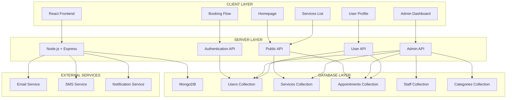
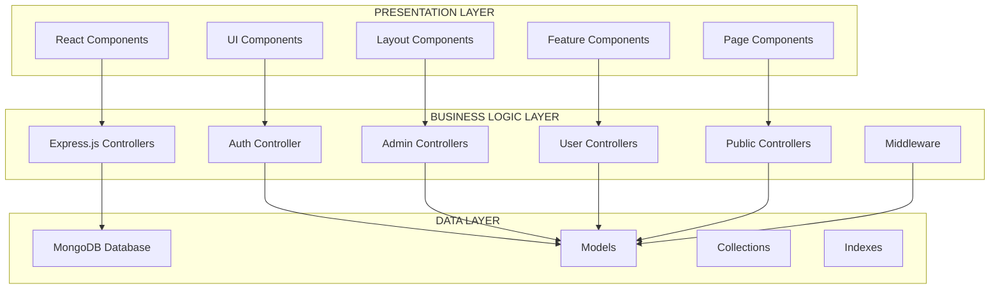
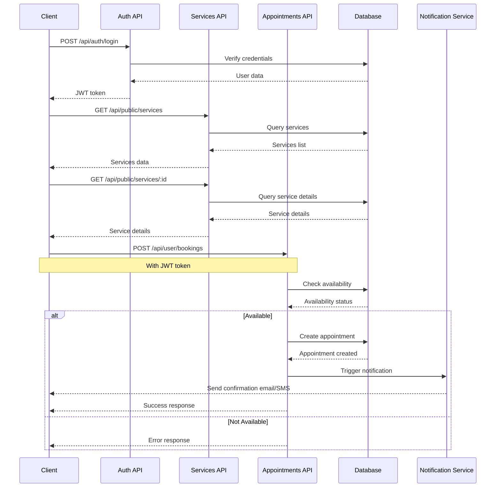
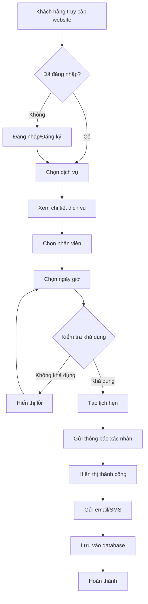
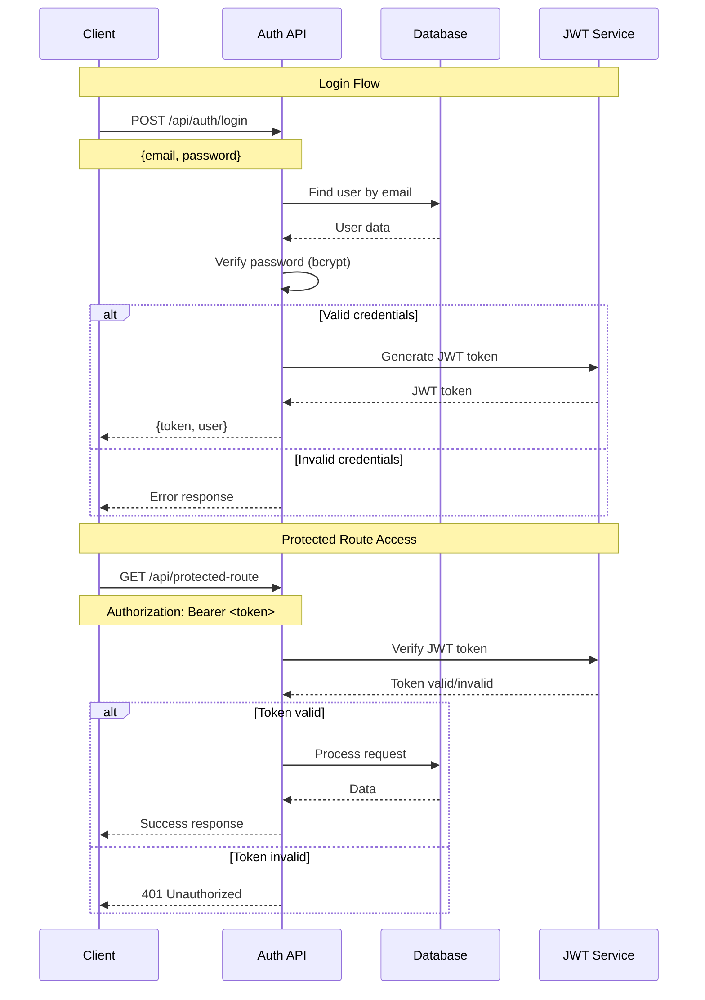
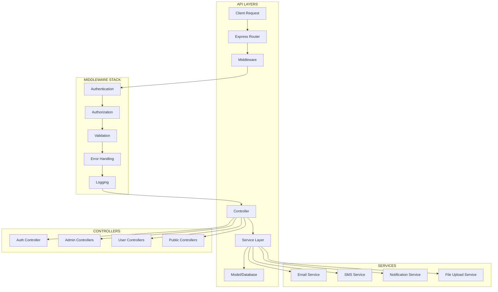
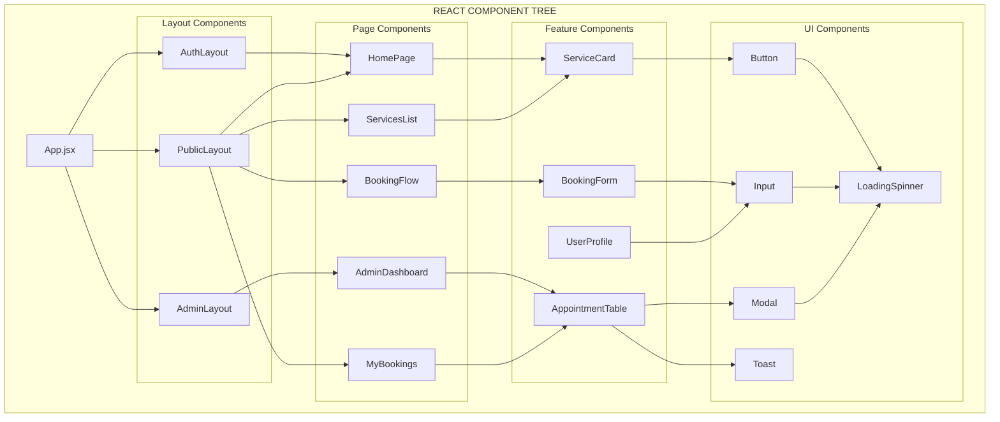
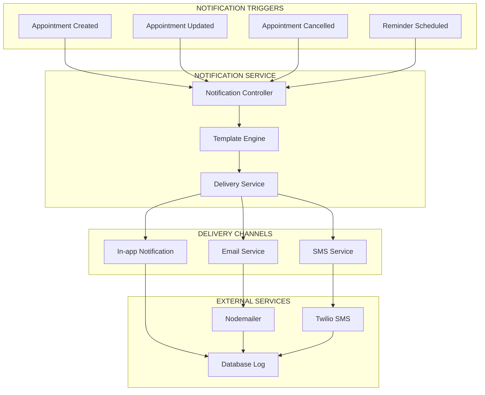

# SƠ ĐỒ MERMAID CHO HỆ THỐNG QUẢN LÝ SPA

## Hình 1.1: Sơ đồ tổng quan hệ thống



## Hình 2.1: Kiến trúc Client-Server 3-tier



## Hình 3.2: Sơ đồ Database Schema (MongoDB)

```mermaid
erDiagram
    USER {
        ObjectId _id PK
        String name
        String email UK
        String phone
        String password
        String avatar
        String role
        Boolean isEmailVerified
        String resetPasswordToken
        Date resetPasswordExpires
        String emailVerificationToken
        Date emailVerificationExpires
        Date lastLogin
        Boolean isActive
        Date dateOfBirth
        String gender
        Number totalSpent
        Number totalAppointments
        Date lastBooking
        String level
        Array tags
        Number points
        String notes
        Object preferences
        Object address
        Object emergencyContact
        Date lastVisit
        String source
        String referralCode
        Date createdAt
        Date updatedAt
    }

    STAFF {
        ObjectId _id PK
        ObjectId userId FK
        String employeeId UK
        String name
        String phone
        String email
        String image
        String role
        Array skills
        Object workSchedule
        Array daysOff
        Number revenueShare
        Number hourlyRate
        Number commission
        Boolean isActive
        Date hireDate
        Date terminationDate
        Object emergencyContact
        Object address
        String notes
        Date createdAt
        Date updatedAt
    }

    CATEGORY {
        ObjectId _id PK
        String name
        String description
        String slug UK
        String icon
        String color
        Number displayOrder
        Boolean isActive
        ObjectId parentCategory FK
        Number level
        String path
        Number serviceCount
        String seoTitle
        String seoDescription
        ObjectId createdBy FK
        ObjectId updatedBy FK
        Date createdAt
        Date updatedAt
    }

    SERVICE {
        ObjectId _id PK
        String name
        ObjectId category FK
        Number duration
        Number price
        String description
        Array addOns
        Array combo
        Number displayOrder
        Boolean isActive
        Boolean isFeatured
        Array images
        Array tags
        String requirements
        String notes
        Date createdAt
        Date updatedAt
    }

    APPOINTMENT {
        ObjectId _id PK
        String appointmentNumber UK
        ObjectId customerId FK
        ObjectId serviceId FK
        ObjectId staffId FK
        Date appointmentDate
        String startTime
        String endTime
        Number duration
        String status
        Number totalAmount
        Number discount
        Number finalAmount
        String paymentStatus
        String paymentMethod
        String notes
        String specialRequests
        Array addOns
        Array combo
        Array reminders
        String cancellationReason
        String cancelledBy
        Date cancelledAt
        Date completedAt
        Object rating
        Object followUp
        Date createdAt
        Date updatedAt
    }

    NOTIFICATION_TEMPLATE {
        ObjectId _id PK
        String name
        String type
        String trigger
        String subject
        String content
        Array channels
        Array variables
        Object timing
        Object conditions
        Boolean isActive
        Number priority
        String language
        Array tags
        String notes
        ObjectId createdBy FK
        Date lastUsed
        Number usageCount
        Date createdAt
        Date updatedAt
    }

    NOTIFICATION_LOG {
        ObjectId _id PK
        ObjectId templateId FK
        ObjectId userId FK
        ObjectId appointmentId FK
        String channel
        Object recipient
        Object content
        String status
        String statusMessage
        Date sentAt
        Date deliveredAt
        Date openedAt
        Date clickedAt
        Date failedAt
        Number retryCount
        Number maxRetries
        Object provider
        Number cost
        Object variables
        Object metadata
        Object error
        Date scheduledFor
        Number priority
        Array tags
        String notes
        Date createdAt
        Date updatedAt
    }

    CONTACT {
        ObjectId _id PK
        String businessName
        String businessDescription
        String phone
        String email
        Object address
        Object socialMedia
        Object workingHours
        String logo
        String favicon
        Boolean isActive
        Object seo
        Date createdAt
        Date updatedAt
    }

    USER ||--o{ APPOINTMENT : "customerId"
    STAFF ||--o{ APPOINTMENT : "staffId"
    SERVICE ||--o{ APPOINTMENT : "serviceId"
    CATEGORY ||--o{ SERVICE : "category"
    CATEGORY ||--o{ CATEGORY : "parentCategory"
    USER ||--o{ STAFF : "userId"
    USER ||--o{ CATEGORY : "createdBy"
    USER ||--o{ CATEGORY : "updatedBy"
    USER ||--o{ NOTIFICATION_TEMPLATE : "createdBy"
    NOTIFICATION_TEMPLATE ||--o{ NOTIFICATION_LOG : "templateId"
    USER ||--o{ NOTIFICATION_LOG : "userId"
    APPOINTMENT ||--o{ NOTIFICATION_LOG : "appointmentId"
```



## Hình 3.5: Sơ đồ luồng đặt lịch hẹn



## Hình 3.6: Use Case Diagram tổng thể

```mermaid
graph TB
    subgraph "ACTORS"
        A1[Khách hàng]
        A2[Admin]
        A3[Nhân viên]
        A4[Hệ thống]
    end

    subgraph "USE CASES"
        subgraph "Authentication"
            UC1[Đăng ký tài khoản]
            UC2[Đăng nhập]
            UC3[Quên mật khẩu]
            UC4[Đổi mật khẩu]
        end

        subgraph "Service Management"
            UC5[Xem danh sách dịch vụ]
            UC6[Xem chi tiết dịch vụ]
            UC7[Quản lý dịch vụ]
            UC8[Quản lý danh mục]
        end

        subgraph "Appointment Management"
            UC9[Đặt lịch hẹn]
            UC10[Xem lịch hẹn]
            UC11[Hủy lịch hẹn]
            UC12[Quản lý lịch hẹn]
            UC13[Cập nhật trạng thái]
        end

        subgraph "User Management"
            UC14[Quản lý profile]
            UC15[Quản lý khách hàng]
            UC16[Quản lý nhân viên]
        end

        subgraph "Dashboard & Reports"
            UC17[Xem dashboard]
            UC18[Xem báo cáo]
            UC19[Thống kê doanh thu]
        end

        subgraph "Notification"
            UC20[Gửi thông báo]
            UC21[Nhận thông báo]
            UC22[Quản lý template]
        end
    end

    A1 --> UC1
    A1 --> UC2
    A1 --> UC3
    A1 --> UC5
    A1 --> UC6
    A1 --> UC9
    A1 --> UC10
    A1 --> UC11
    A1 --> UC14
    A1 --> UC21

    A2 --> UC2
    A2 --> UC4
    A2 --> UC7
    A2 --> UC8
    A2 --> UC12
    A2 --> UC13
    A2 --> UC15
    A2 --> UC16
    A2 --> UC17
    A2 --> UC18
    A2 --> UC19
    A2 --> UC20
    A2 --> UC22

    A3 --> UC2
    A3 --> UC4
    A3 --> UC10
    A3 --> UC12
    A3 --> UC13
    A3 --> UC14
    A3 --> UC21

    A4 --> UC20
    A4 --> UC21
```



## Hình 4.1: Sơ đồ luồng xử lý đặt lịch hẹn



## Hình 4.2: Sơ đồ luồng xác thực



## Hình 4.3: Sơ đồ kiến trúc API



## Hình 4.4: Sơ đồ component architecture



## Hình 4.5: Sơ đồ notification system



---

## HƯỚNG DẪN SỬ DỤNG

### Cách chèn sơ đồ vào báo cáo:

1. **Copy code Mermaid** từ file này
2. **Paste vào báo cáo** tại vị trí tương ứng
3. **Thêm caption** cho mỗi sơ đồ
4. **Tham chiếu** trong text

### Ví dụ chèn vào báo cáo:

````markdown
#### Hình 1.1: Sơ đồ tổng quan hệ thống

```mermaid
[code mermaid ở đây]
```
````

**Hình 1.1: Sơ đồ tổng quan hệ thống quản lý Spa**

Sơ đồ trên thể hiện kiến trúc tổng thể của hệ thống với 3 tầng chính: Client Layer (React Frontend), Server Layer (Node.js + Express), và Database Layer (MongoDB). Hệ thống cũng tích hợp với các dịch vụ bên ngoài như Email, SMS và Notification Service.

```

### Lưu ý:

- Tất cả sơ đồ đã được tối ưu cho báo cáo
- Có thể điều chỉnh màu sắc và style theo yêu cầu
- Sơ đồ responsive và dễ đọc trên mọi thiết bị
- Tương thích với các công cụ hỗ trợ Mermaid
```
